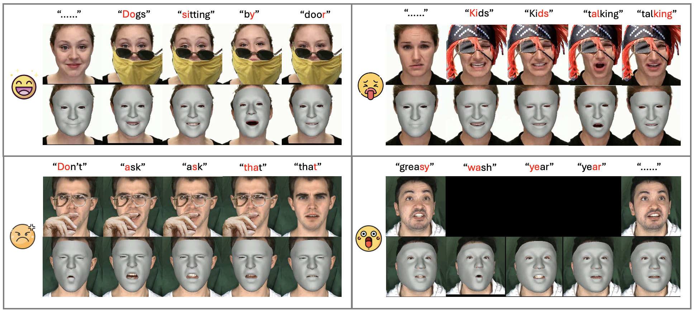

<div align="center">

  # OccluFaceDiff: Multimodal-Conditioned Occlusion-Aware 3D Facial Animation Using Diffusion
</div>

<p align="center"> 


</p>

<p align="center"> 

</p>
<p align="center"> Our method recovers 3D facial motions from occluded videos given sparse landmarks and raw audios as the input. Here we provide reconstructions for 4 emotional talking sequences with varying occlusion types. <p align="center">

## Installation
Clone the repo:
```bash
git clone https://github.com/EvelynQIN/OccluFaceDiff
cd OccluFaceDiff
```  

You need to install torch and a compatible version of Pytorch 3D following [the official repo](https://github.com/facebookresearch/pytorch3d). You can use the following commands to create a working installation:
```bash
conda create -n "facediff" python=3.8
pip install torch==1.13.1+cu117 torchvision==0.14.1+cu117 torchaudio==0.13.1 --extra-index-url https://download.pytorch.org/whl/cu117
conda install -c conda-forge -c fvcore fvcore iopath 
pip install --no-index --no-cache-dir pytorch3d -f https://dl.fbaipublicfiles.com/pytorch3d/packaging/wheels/py310_cu117_pyt1131/download.html
pip install -r requirements.txt # install the rest of the requirements
```

Download the [FLAME model](https://flame.is.tue.mpg.de/) (we use flame_2020 for training), pretrained motion prior (FLINT) from [EMOTE](https://emote.is.tue.mpg.de/index.html), and our pretrained OccluFaceDiff model:
```bash
bash download_assets.sh
```

## Train

### Dataset
OccluFaceDiff uses MEAD dataset for training. [MEAD](https://wywu.github.io/projects/MEAD/MEAD.html) is a large-scale emotional talking face video dataset. To train the model, you need to download the raw videos and the paired audio for each subject from the official webpage, and place them into 'dataset/mead_25fps/original_data' folder.

To get the detected landmarks and pseudo-gt of FLAME reconstructions extracted from EMOTE, run: 
```bash
bash data_process_MEAD/download_processed_mead.sh
```

### Preprocess
The data preprocessing consists of 4 steps:
1. preprocess and downsample the audio into 16kHZ
```bash
python3 data_process_MEAD/extract_audio_input.py
```

2. convert each video into 25 fps
```bash
python3 data_process_MEAD/convert_video_to_25fps.py
```

3. crop the video frames around the detected landmarks and resize to (224, 224), and normalize landmarks into [-1, 1]
```bash
python3 data_process_MEAD/crop_videos.py
python3 data_process_MEAD/extract_lmks.py
```

### Train OccluFaceDiff from scratch
```bash
python3 train.py --config_path configs/train_OccluFaceDiff.yaml
```

## Test reconstruction on MEAD
To test the model on a MEAD video for subject M003, level_2 angry emotion and sentence id = 1, with random mouth occlusion, run the following code. It will output the reconstructed video and the evaluation log.
```bash
python3 test_mead.py --model_path pretrained/OccluFaceDiff_768d_FLINT/model_46.pt --split test --subject M003 --emotion angry --level level_2 --sent 1 --input_motion_length 64 --exp_name mouth --vis --to_mp4
```

## Demo
We provide the demo to synthesize 3D facial motions from a given RGB video. We support multiple occlusion types ['non_occ', 'audio_driven', 'mouth', 'upper', 'random'], where random occlusion mask of the specified type would be applied to the original video.

You can freely add more occlusion masks to 'dataset/occ_masks'.
```bash
python3 predict.py --model_path pretrained/OccluFaceDiff_768d_FLINT/model_46.pt --save_folder vis_result --input_motion_length 64 --occlusion_type mouth --video_path dataset/videos/demo1.mp4 --to_mp4
```
